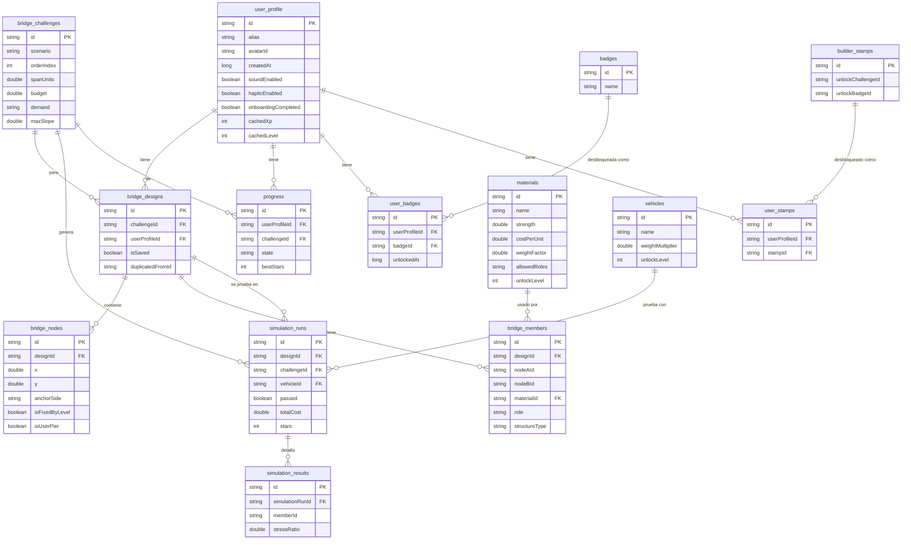

# Base de Datos — PuenteLab

Room / SQLite. 14 entidades, versión de esquema 1. Ver también `database/schema.sql` (espejo en
SQL puro) y `database/sample_data.sql` (una muestra representativa de los datos semilla).

## Diagrama Entidad-Relación (Mermaid)



## Tablas, claves e índices

| Tabla | PK | FKs | Índices | Notas |
|---|---|---|---|---|
| `user_profile` | `id` | — | — | Fila única (`local_user`); sin datos personales. |
| `materials` | `id` | — | — | 8 filas semilla. `allowedRoles` guardado como CSV. |
| `bridge_challenges` | `id` | — | — | 45 filas semilla (9 x 5 escenarios). |
| `bridge_designs` | `id` | `challengeId`->challenges (CASCADE), `userProfileId`->profile (CASCADE) | `challengeId`, `userProfileId`, `isSaved` | `isSaved=1` cuenta contra el cupo de 15. |
| `bridge_nodes` | `id` | `designId`->designs (CASCADE) | `designId` | Coordenadas de cuadrícula (x, y). |
| `bridge_members` | `id` | `designId`->designs (CASCADE), `materialId`->materials (RESTRICT) | `designId`, `materialId` | RESTRICT evita borrar un material en uso. |
| `vehicles` | `id` | — | — | 6 filas semilla. |
| `simulation_runs` | `id` | `designId`, `challengeId`, `vehicleId` (CASCADE/RESTRICT) | `designId`, `challengeId`, `vehicleId`, `ranAt` | Historial real de intentos; fuente de XP/insignias. |
| `simulation_results` | `id` | `simulationRunId`->simulation_runs (CASCADE) | `simulationRunId` | Detalle por barra de cada intento. |
| `builder_stamps` | `id` | — | — | 12 filas semilla; `unlockChallengeId`/`unlockBadgeId` opcionales. |
| `user_stamps` | `id` | `userProfileId`, `stampId` (CASCADE) | `userProfileId`, `stampId` | Registro de cuándo se desbloqueó cada sello. |
| `progress` | `id` | `userProfileId`, `challengeId` (CASCADE) | `userProfileId`, `challengeId` | Estado cacheado (bloqueado/disponible/iniciado/completado/dominado). |
| `badges` | `id` (enum) | — | — | 9 filas semilla, generadas desde `BadgeEngine.catalog`. |
| `user_badges` | `id` | `userProfileId`, `badgeId` (CASCADE) | `userProfileId`, `badgeId` | Insert con `OnConflictStrategy.IGNORE`: nunca duplica. |

## Restricciones de negocio relevantes

- Máximo 15 diseños con `isSaved = 1` por usuario — se aplica en `DesignRepository`, no en SQL puro (SQLite no tiene `CHECK` con subconsultas portable en Room sin triggers manuales; se documenta como decisión de capa de aplicación).
- `bridge_members.materialId` usa `ON DELETE RESTRICT`: nunca se puede borrar un material referenciado por una barra existente.
- Todo lo demás usa `ON DELETE CASCADE` desde el perfil/diseño/intento hacia sus hijos, para que borrar un diseño o un intento no deje filas huérfanas.
- `user_badges` y `user_stamps` insertan con `OnConflictStrategy.IGNORE` sobre PK: desbloquear la misma insignia/sello dos veces nunca duplica fila.

## Consultas importantes (ejemplos)

```sql
-- Progreso agregado por escenario
SELECT c.scenario, COUNT(*) FILTER (WHERE p.state IN ('COMPLETED','MASTERED')) AS completados, COUNT(*) AS total
FROM bridge_challenges c
LEFT JOIN progress p ON p.challengeId = c.id AND p.userProfileId = 'local_user'
GROUP BY c.scenario;

-- Diseño completo (nodos + barras) para renderizar el constructor
SELECT * FROM bridge_designs WHERE id = ?;
SELECT * FROM bridge_nodes WHERE designId = ?;
SELECT * FROM bridge_members WHERE designId = ?;

-- Historial de intentos de un desafío, más reciente primero
SELECT * FROM simulation_runs WHERE challengeId = ? ORDER BY ranAt DESC;
```

## Simplificación documentada: `SavedDesign`

El encargo original lista `SavedDesign` como entidad propia. Se implementó como el campo
`isSaved: Boolean` de `bridge_designs` en lugar de una tabla separada, para no duplicar el modelo
de nodos/barras entre "diseño de trabajo" y "diseño guardado" (ambos son, en esencia, el mismo
grafo de nodos y barras; lo único que cambia es si cuenta contra el cupo de 15 y si tiene nombre
elegido por el usuario). `DesignRepository.saveToMyDesigns()` y `.duplicate()` son las operaciones
que tocan ese campo.
